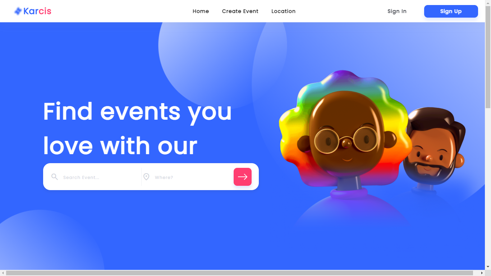

<h1 align='center'>Karcis Project</h1>
  <p align="center">
    <a href="https://karcis-project-website.netlify.app">View Demo</a>
    ·
    <a href="https://github.com/billhikmah/karcis-project-responsive-website/issues">Report Bug</a>
    ·
    <a href="https://github.com/billhikmah/karcis-project-responsive-website/pulls">Request Feature</a>
  </p>



## About The Project

Karcis Project is a website for purchasing event tickets. This website is built using HTML, CSS, React and Bootstrap. This responsive website can be accessed through various devices such as mobile phones, tablets, iPads, and PCs.

## Built With

[](https://getbootstrap.com/)
[](https://getbootstrap.com/)
[](https://reactjs.org/)
[](https://getbootstrap.com/)

## Acknowledgements

- [Bootstrap](https://getbootstrap.com/)

<h2>How to Install</h2>

1. Clone the repository
   ```
   https://github.com/billhikmah/CoffeeShop-Frontend-HTML-CSS
   ```
2. Open the file using [VSCode](https://code.visualstudio.com/download)
3. Run this command below to install dependencies
   ```
   npm run install
   ```
4. Create .env file and put this code
   ```
   REACT_APP_BASE_URL="https://karcis-project-server.vercel.app"
   ```
5. Finally, to start this project, run this code on your terminal
   ```
   npm run start
   ```

<h2>Related Documentation</h2>

- Server (Backend)<br>
  The backend has been deployed to [Vercel](https://www.vercel.com) and the assets have been uploaded to [Cloudinary](https://www.cloudinary.app/).
- Postman Documentation
  Server documentation can be accessed via [Postman](https://documenter.getpostman.com/view/20723287/VV51tET9).

## License

© [Bill Hikmah 2022](https://github.com/billhikmah/)
